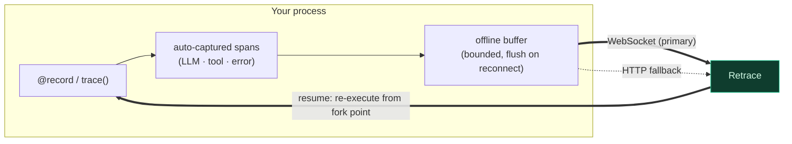

<div align="center">


Record every LLM call, tool invocation, and error your agent makes. Replay it step-by-step like a video. Fork from any point, change the input, and watch the whole agent re-execute down a new path. Share any run as an interactive, public link.

[Python](#python) · [TypeScript](#typescript) · [How It Works](#how-it-works) · [Docs](https://docs.retraceai.tech)

</div>

---

## Python

```bash
pip install retrace-sdk
```

```python
import retrace

retrace.configure(api_key="rt_...")

@retrace.record(name="research-agent", resumable=True)
def run_agent(prompt: str):
    plan = call_planner(prompt)    # captured automatically
    results = call_tools(plan)     # captured automatically
    return summarize(results)      # captured automatically

run_agent("What changed in vector databases this year?")
```

See [`python/README.md`](python/README.md) for the full reference.

## TypeScript

```bash
npm install retrace-sdk
```

```typescript
import { configure, trace } from "retrace-sdk";

configure({ apiKey: "rt_..." });

const runAgent = trace(async (prompt: string) => {
  const plan = await callPlanner(prompt);   // captured automatically
  const results = await callTools(plan);    // captured automatically
  return summarize(results);                // captured automatically
}, { name: "research-agent", resumable: true });

await runAgent("What changed in vector databases this year?");
```

See [`typescript/README.md`](typescript/README.md) for the full reference.

---

## How It Works

The SDK is a thin capture layer. It wraps your function, auto-instruments provider calls (OpenAI, Anthropic, Gemini), and streams spans to Retrace over a resilient transport — never blocking or crashing your agent.



- **Capture** — provider calls are intercepted automatically; you can also emit manual spans.
- **Transport** — spans stream over a WebSocket; if it drops, the SDK falls back to HTTP and replays a bounded offline buffer on reconnect, so nothing is lost.
- **Resumable** — mark a function resumable and a dashboard fork re-executes it from any step with modified input (cascade replay).
- **Safe by default** — failures in the SDK never surface into your agent; typed errors expose real problems explicitly.

---

## Documentation

Full documentation at [docs.retraceai.tech](https://docs.retraceai.tech).

## License

MIT
