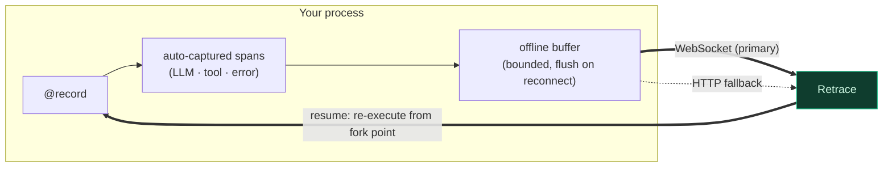

<div align="center">


Record every LLM call, tool invocation, and error your agent makes. Replay it step-by-step like a video. Fork from any point, change the input, and watch the whole agent re-execute down a new path. Share any run as an interactive, public link.

[Quick Start](#quick-start) · [How It Works](#how-it-works) · [Recipes](#usage-recipes) · [Enforcement](#enforcement-circuit-breakers) · [Docs](https://docs.retraceai.tech)

</div>

---

## Install

```bash
pip install retrace-sdk
```

Requires Python 3.10+.

---

## Quick Start

```python
import retrace

retrace.configure(api_key="rt_...")  # get a key in the dashboard

@retrace.record(name="research-agent", resumable=True)
def run_agent(prompt: str):
    plan = call_planner(prompt)        # captured automatically
    results = call_tools(plan)         # captured automatically
    return summarize(results)          # captured automatically

run_agent("What changed in vector databases this year?")
```

That's it. The run appears in the dashboard as an interactive timeline you can scrub, replay, and fork.

---

## How It Works

The SDK is a thin capture layer. It wraps your function, auto-instruments provider calls, and streams spans to Retrace over a resilient transport — never blocking or crashing your agent.



- **Capture** — provider calls (OpenAI, Anthropic, Gemini) are intercepted automatically; you can also emit manual spans.
- **Transport** — spans stream over a **WebSocket**; if it drops, the SDK falls back to **HTTP** and replays a bounded **offline buffer** on reconnect, so nothing is lost. A flush-on-exit hook captures runs that end abruptly.
- **Resumable** — with `resumable=True`, a dedicated listener handles a `resume` command and **re-executes your function from a fork point** with modified input, powering cascade replay from the dashboard.
- **Safe by default** — failures in the SDK never raise into your agent; typed errors surface real problems explicitly.

---

## Auto-Instrumentation

LLM calls from major providers are captured with no extra code — just install the provider SDK alongside `retrace-sdk`:

| Provider | Captured automatically |
|---|---|
| **OpenAI** | chat completions |
| **Anthropic** | messages |
| **Google Gemini** | generate content |

---

## Capabilities

| Capability | What it does |
|---|---|
| **Record** | One `@record` decorator captures the full execution tree. |
| **Cascade replay** | `resumable=True` lets a dashboard fork re-execute the whole function from any step. |
| **Enforcement** | Local budget/step/loop ceilings stop a runaway agent *before* the next call. |
| **Multi-agent** | Tag spans with an agent id/role for topology + inter-agent detectors. |
| **Golden cassettes** | Record a run as a CI regression fixture and gate on it offline. |
| **Sampling** | Record a fraction of traffic in production. |
| **Sessions** | Group multi-turn conversations under one session. |

---

## Usage Recipes

### Configure

```python
import retrace

retrace.configure(
    api_key="rt_...",                  # or RETRACE_API_KEY
    base_url="https://api.retraceai.tech",
    project_id="...",                  # or RETRACE_PROJECT_ID
)
```

Set `RETRACE_ENABLED=false` to disable recording without changing code.

### Resumable execution (cascade replay)

```python
@retrace.record(name="my-agent", resumable=True)
def run_agent(prompt: str):
    plan = call_planner(prompt)
    result = call_executor(plan)
    return summarize(result)
```

When you fork at any span in the dashboard, the SDK re-executes the **entire** function with the modified input — not just one call. Every downstream step that depends on the change diverges.

### Enforcement (circuit breakers)

```python
import retrace
from retrace import RetraceEnforcementError

retrace.configure(
    api_key="rt_...",
    max_steps_per_run=50,
    max_usd_per_run=2.0,
    server_enforcement=True,  # optional: also consult centrally-managed server policies
)

try:
    run_agent("...")
except RetraceEnforcementError as e:
    print(e.verdict, e.reason)  # e.g. "block", "Local USD ceiling reached: ..."
```

Local ceilings are enforced offline (zero network). Precedence: explicit arg > env var (`RETRACE_MAX_STEPS_PER_RUN`, `RETRACE_MAX_TOKENS_PER_RUN`, `RETRACE_MAX_USD_PER_RUN`, `RETRACE_SERVER_ENFORCEMENT`) > unset. If the server check is unreachable, local limits still apply.

### Multi-agent context

```python
import retrace

with retrace.agent("planner", role="planner"):
    plan = call_planner(prompt)
with retrace.agent("executor", role="executor"):
    result = call_executor(plan)
```

Tags spans so the dashboard can draw the agent topology and run inter-agent detectors (ping-pong, reasoning–action mismatch, task derailment).

### Golden cassettes (CI regression gates)

```python
from retrace import write_golden_cassette

write_golden_cassette("golden.json", recorder=rec)
```

Gate on it offline in CI with `retrace ci replay`.

### Sampling

```python
retrace.configure(api_key="rt_...", sample_rate=0.1)  # record 10% of traces
```

### Error handling

```python
from retrace import (
    RetraceError,
    RetraceAuthError,
    RetraceCreditsExhaustedError,
    RetraceRateLimitError,
    RetraceEnforcementError,
)
```

Typed errors for auth failures, credit exhaustion, rate limiting, and enforcement blocks. Transient transport problems never crash your agent.

---

## Links

- [Documentation](https://docs.retraceai.tech)
- [GitHub](https://github.com/yash1511-bogam/retrace-sdk)
- [PyPI](https://pypi.org/project/retrace-sdk/)

## License

MIT
