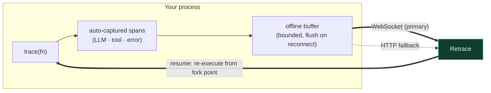

<div align="center">


Record every LLM call, tool invocation, and error your agent makes. Replay it step-by-step like a video. Fork from any point, change the input, and watch the whole agent re-execute down a new path. Share any run as an interactive, public link.

[Quick Start](#quick-start) · [How It Works](#how-it-works) · [Recipes](#usage-recipes) · [Enforcement](#enforcement-circuit-breakers) · [Docs](https://docs.retraceai.tech)

</div>

---

## Install

```bash
npm install retrace-sdk
```

Requires Node.js 20+. ESM-only. Works in Node and edge runtimes.

---

## Quick Start

```typescript
import { configure, trace } from "retrace-sdk";

configure({ apiKey: "rt_..." }); // get a key in the dashboard

const runAgent = trace(async (prompt: string) => {
  const plan = await callPlanner(prompt);   // captured automatically
  const results = await callTools(plan);    // captured automatically
  return summarize(results);                // captured automatically
}, { name: "research-agent", resumable: true });

await runAgent("What changed in vector databases this year?");
```

That's it. The run appears in the dashboard as an interactive timeline you can scrub, replay, and fork.

---

## How It Works

The SDK is a thin capture layer. It wraps your function, auto-instruments provider calls, and streams spans to Retrace over a resilient transport — never blocking or crashing your agent.



- **Capture** — provider calls (OpenAI, Anthropic, Gemini) are intercepted automatically; you can also emit manual spans.
- **Transport** — spans stream over a **WebSocket**; if it drops, the SDK falls back to **HTTP** and replays a bounded **offline buffer** on reconnect, so nothing is lost.
- **Resumable** — with `resumable: true`, the SDK listens for a `resume` command and **re-executes your function from a fork point** with modified input, powering cascade replay from the dashboard.
- **Safe by default** — failures in the SDK never throw into your agent; typed errors surface real problems explicitly.

---

## Auto-Instrumentation

LLM calls from major providers are captured with no extra code — just install the provider SDK alongside `retrace-sdk`:

| Provider | Captured call |
|---|---|
| **OpenAI** | `openai.chat.completions.create()` |
| **Anthropic** | `anthropic.messages.create()` |
| **Google Gemini** | `ai.models.generateContent()` |

Framework adapters are available for agent frameworks (e.g. LangChain, Vercel AI SDK) — see the [docs](https://docs.retraceai.tech).

---

## Capabilities

| Capability | What it does |
|---|---|
| **Record** | One `trace()` wrapper captures the full execution tree. |
| **Cascade replay** | `resumable: true` lets a dashboard fork re-execute the whole function from any step. |
| **Enforcement** | Local budget/step/loop ceilings stop a runaway agent *before* the next call. |
| **Multi-agent** | Tag spans with an agent id/role for topology + inter-agent detectors. |
| **Golden cassettes** | Record a run as a CI regression fixture and gate on it offline. |
| **Sampling** | Record a fraction of traffic in production. |
| **Sessions** | Group multi-turn conversations under one session. |

---

## Usage Recipes

### Configure

```typescript
import { configure } from "retrace-sdk";

configure({
  apiKey: "rt_...",                  // or RETRACE_API_KEY
  baseUrl: "https://api.retraceai.tech",
  projectId: "...",                  // or RETRACE_PROJECT_ID
});
```

Set `RETRACE_ENABLED=false` to disable recording without changing code.

### Manual spans

```typescript
import { record, SpanType } from "retrace-sdk";

const recorder = record({ name: "custom-agent" });
recorder.start();

const span = recorder.startSpan("web-search", SpanType.TOOL_CALL, { query: "latest news" });
// ... do work ...
recorder.endSpan(span, { results: ["..."] });

recorder.end("Done");
```

### Resumable execution (cascade replay)

```typescript
const runAgent = trace(async (prompt: string) => {
  const plan = await planner(prompt);
  const result = await executor(plan);
  return summarize(result);
}, { name: "my-agent", resumable: true });
```

When you fork at any span in the dashboard, the SDK re-executes the **entire** function with the modified input — not just one call. Every downstream step that depends on the change diverges.

### Enforcement (circuit breakers)

```typescript
import { configure, RetraceEnforcementError } from "retrace-sdk";

configure({
  apiKey: "rt_...",
  maxStepsPerRun: 50,
  maxUsdPerRun: 2.0,
  serverEnforcement: true, // optional: also consult centrally-managed server policies
});

try {
  await runAgent("...");
} catch (e) {
  if (e instanceof RetraceEnforcementError) console.log(e.verdict, e.reason);
}
```

Local ceilings are enforced offline (zero network). Precedence: explicit arg > env var (`RETRACE_MAX_STEPS_PER_RUN`, `RETRACE_MAX_TOKENS_PER_RUN`, `RETRACE_MAX_USD_PER_RUN`, `RETRACE_SERVER_ENFORCEMENT`) > unset. If the server check is unreachable, local limits still apply.

### Multi-agent context

```typescript
import { withAgent } from "retrace-sdk";

await withAgent({ id: "planner", role: "planner" }, async () => {
  await callPlanner(prompt);
});
```

Tags spans so the dashboard can draw the agent topology and run inter-agent detectors (ping-pong, reasoning–action mismatch, task derailment).

### Golden cassettes (CI regression gates)

```typescript
import { writeGoldenCassette } from "retrace-sdk";

writeGoldenCassette("golden.json", { recorder });
```

Gate on it offline in CI with `retrace ci replay`.

### Sampling

```typescript
configure({ apiKey: "rt_...", sampleRate: 0.1 }); // record 10% of traces
```

### Error handling

```typescript
import {
  RetraceError,
  RetraceAuthError,
  RetraceCreditsExhaustedError,
  RetraceRateLimitError,
  RetraceEnforcementError,
} from "retrace-sdk";
```

Typed errors for auth failures, credit exhaustion, rate limiting, and enforcement blocks. Transient transport problems never crash your agent.

---

## Links

- [Documentation](https://docs.retraceai.tech)
- [GitHub](https://github.com/yash1511-bogam/retrace-sdk)
- [npm](https://www.npmjs.com/package/retrace-sdk)

## License

MIT
